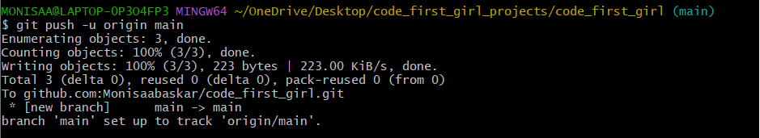

# Learning Git
This document is to log concepts learnt while studying about the basics of Git

## Github
- GitHub is a developer platform that allows developers to create, store, manage and share their code using the git protocol
- It is currently a subsidiary of Microsoft
- A few features of Github mentioned in Wikipedia [^1]
    - Documentation including automatically rendered README files in a variety of Markdown-like file formats
    - Wikis, with some repositories consisting solely of wiki content. These include curated lists of recommended software which have become known as awesome lists
    - GitHub Actions, which allows building continuous integration and continuous deployment pipelines for testing, releasing and deploying software without the use of third-party websites/platforms
    - GitHub Codespaces, an online IDE providing users with a virtual machine intended to be a work environment to build and test code
    - Graphs: pulse, contributors, commits, code frequency, punch card, network, members
    - Email notifications
    - Discussions

## Git protocol
- Git is source control protocol useful for version control and developer collaboration
- Git helps to organize projects as snapshots over time and track these snapshots by labelling each snapshot with a unique commit ID
- Git supports concept of branches which helps to develop multiple features and developers concurrently
- With Git it is possible to remotely store projects on websites like GitHub and GitLab
- Git implements source control by maintaining a local and remote copy of the repository. 
- In the local
    - The project files are initially untracked
    - Once the files are tracked in the repository, the files can be moved to the staging area if they are modified. 
    - Once we are confirmed that the files have satisfactory changes and reached required stable state they can be committed as a snapshot called commit. Each commit has an unique ID

## Git commands
### git clone
Used for cloning a remote repository to the local

### git add
Used for adding a modified file to staging area or start tracking a new file and then stage it

### git commit
Used for marking a file has reached a satisfactory state and can be part of the snapshot. The snapshot will have a unique id and it is good practise to have a meaningful comment about the changes part of the snapshot

### ssh-keys
- While pushing from the local repository on the disk to remote repository on the site like Github, it is required to be done safely only by owner and authorised users of the repository
- This can be done using ssh-keys
- A public and private ssh keys are generated on the local computer using the name and email of the user
- The public key is stored in the Github under the user settings and the private key is stored on the local computer. 
- The key can be added to the current session of the terminal
- Once added user can communicate with remote repository safely

> [!CAUTION]
> Never share the private key with anyone

### git push
Used for pushing the local commits to the remote repository

### .gitignore
A .gitignore file is a hidden file which can be used to make sure that the git will not track a list of files

### requirements.txt
A requirments.txt file can be used to list all the Python packages required for the current package which can later be installed with pip. The file can also mention the specific version of the package required for the project

References
[^1] [Wikipedia](https://en.wikipedia.org/wiki/GitHub)